# 🏗️ Arquitectura del Sistema - Biometric DID App

## Diagrama de Arquitectura Completo

```mermaid
graph TB
    %% Usuario y dispositivos
    A[👤 Usuario] --> B[🌐 Browser]
    B --> C[📱 Frontend Apps]
    
    %% Frontend layer
    C --> D[⚛️ React Components]
    C --> E[🎥 VideoCapture]
    C --> F[💳 WalletConnect]
    
    %% Procesamiento biométrico
    E --> G[📹 Media Stream API]
    G --> H[🖼️ Canvas Processing]
    H --> I[🔐 SHA-256 Hashing]
    I --> J[📋 Biometric Hash]
    
    %% Wallet integration
    F --> K[🔌 Freighter API]
    K --> L[🗝️ Wallet Address]
    K --> M[✍️ Transaction Signing]
    
    %% Smart contract interaction
    J --> N[📝 Contract Helpers]
    L --> N
    N --> O[🏗️ Transaction Builder]
    O --> P[🧪 Simulation]
    P --> Q[📡 Stellar RPC]
    
    %% Blockchain layer
    Q --> R[⭐ Stellar Testnet]
    R --> S[📋 Soroban Runtime]
    S --> T[🔐 BiometricContract]
    T --> U[🗄️ DID Registry]
    
    %% Data persistence
    U --> V[💾 Blockchain Storage]
    V --> W[🔒 Immutable Records]
    
    %% Styling
    classDef frontend fill:#e1f5fe,stroke:#0288d1,stroke-width:2px
    classDef blockchain fill:#e8f5e8,stroke:#388e3c,stroke-width:2px
    classDef biometric fill:#fff3e0,stroke:#f57c00,stroke-width:2px
    classDef wallet fill:#f3e5f5,stroke:#7b1fa2,stroke-width:2px
    
    class C,D,E,F frontend
    class R,S,T,U,V,W blockchain
    class G,H,I,J biometric
    class K,L,M wallet
```

## Flujo de Datos Detallado

### 1. Inicialización del Sistema

### 2. Creación de DID con Biometría

```mermaid
sequenceDiagram
    participant U as 👤 Usuario
    participant V as 🎥 VideoCapture
    participant P as 🔐 Processor
    participant C as 📋 Contract
    participant B as ⭐ Blockchain
    
    U->>V: Click "Iniciar Cámara"
    V->>V: requestMediaDevices()
    V->>U: Muestra video stream
    
    U->>V: Click "Capturar Biométricos"
    V->>V: Countdown 3, 2, 1...
    V->>P: Captura frame de video
    P->>P: Canvas processing
    P->>P: SHA-256 hashing
    P-->>V: Biometric hash
    
    V->>C: createDID(walletAddress, hash)
    C->>B: Construye transacción
    B->>U: Solicita firma
    U->>B: Firma transacción
    B->>B: Ejecuta en blockchain
    B-->>C: Confirmación de DID
    C-->>V: DID creado exitosamente
    V->>U: Muestra confirmación
```

### 3. Verificación Biométrica

```mermaid
sequenceDiagram
    participant U as 👤 Usuario
    participant V as 🎥 VideoCapture
    participant C as 📋 Contract
    participant B as ⭐ Blockchain
    
    U->>V: Proceso de verificación
    V->>V: Captura nueva biometría
    V->>P: Genera nuevo hash
    P-->>V: Hash de verificación
    
    V->>C: verifyBiometrics(wallet, newHash)
    C->>B: Consulta DID existente
    B-->>C: Datos del DID
    C->>C: Compara hashes
    C->>B: Actualiza estado si coincide
    B-->>C: Resultado de verificación
    C-->>V: Estado de verificación
    V->>U: Muestra resultado
```

## Arquitectura de Componentes

### Frontend Components

```mermaid
graph TD
    A[🌐 App Component] --> B[🎨 Layout]
    A --> C[🔗 WalletConnect]
    A --> D[🎥 VideoCapture]
    A --> E[📊 DIDStatus]
    
    B --> F[🌈 AnimatedBackground]
    B --> G[🎯 Navigation]
    
    C --> H[🔌 Wallet Hooks]
    C --> I[🗄️ Wallet Store]
    
    D --> J[📹 Media Stream]
    D --> K[🖼️ Canvas Processing]
    D --> L[🔐 Hash Generator]
    
    E --> M[📋 Contract Helpers]
    E --> N[📊 Status Display]
    
    H --> O[⚛️ Zustand Store]
    I --> O
    
    M --> P[🏗️ Stellar SDK]
    M --> Q[📡 RPC Client]
    
    classDef component fill:#e3f2fd,stroke:#1976d2,stroke-width:2px
    classDef hook fill:#f3e5f5,stroke:#7b1fa2,stroke-width:2px
    classDef store fill:#e8f5e8,stroke:#388e3c,stroke-width:2px
    classDef sdk fill:#fff3e0,stroke:#f57c00,stroke-width:2px
    
    class A,B,C,D,E,F,G,N component
    class H,J,K,L hook
    class I,O store
    class P,Q,M sdk
```

### Smart Contract Architecture

```mermaid
graph TD
    A[📋 BiometricContract] --> B[🔐 create_did]
    A --> C[✅ verify_biometrics]
    A --> D[📊 get_did]
    A --> E[🔍 has_did]
    A --> F[🔄 update_biometric_hash]
    A --> G[✅ is_verified]
    A --> H[🔐 get_biometric_hash]
    
    B --> I[🗄️ DID Registry]
    C --> I
    D --> I
    E --> I
    F --> I
    G --> I
    H --> I
    
    I --> J[📝 BiometricDID Struct]
    J --> K[🏪 wallet_address]
    J --> L[🔐 biometric_hash]
    J --> M[⏰ created_at]
    J --> N[✅ is_verified]
    
    I --> O[⭐ Stellar Storage]
    O --> P[🔒 Persistent Data]
    O --> Q[🔄 Instance Storage]
    
    classDef contract fill:#e8f5e8,stroke:#388e3c,stroke-width:2px
    classDef function fill:#e1f5fe,stroke:#0288d1,stroke-width:2px
    classDef storage fill:#fff3e0,stroke:#f57c00,stroke-width:2px
    classDef data fill:#f3e5f5,stroke:#7b1fa2,stroke-width:2px
    
    class A contract
    class B,C,D,E,F,G,H function
    class I,O,P,Q storage
    class J,K,L,M,N data
```

## Seguridad y Consideraciones Técnicas

### 1. Procesamiento Biométrico

```mermaid
graph LR
    A[🎥 Video Stream] --> B[🖼️ Canvas Capture]
    B --> C[🔍 Frame Analysis]
    C --> D[📊 Feature Extraction]
    D --> E[🔐 SHA-256 Hash]
    E --> F[📋 Biometric Hash]
    
    G[🚫 Raw Video] -.-> H[❌ Never Stored]
    I[🚫 Biometric Data] -.-> J[❌ Never Transmitted]
    
    style G fill:#ffebee,stroke:#d32f2f,stroke-width:2px
    style H fill:#ffebee,stroke:#d32f2f,stroke-width:2px
    style I fill:#ffebee,stroke:#d32f2f,stroke-width:2px
    style J fill:#ffebee,stroke:#d32f2f,stroke-width:2px
```

### 2. Wallet Security Flow

```mermaid
graph TD
    A[🔐 Wallet Connection] --> B[🔍 Permission Check]
    B --> C[✅ Access Granted]
    C --> D[🗝️ Address Retrieved]
    D --> E[📝 Transaction Building]
    E --> F[✍️ User Signature]
    F --> G[📡 Blockchain Submission]
    
    H[🚫 Private Keys] -.-> I[❌ Never Exposed]
    J[🚫 Seed Phrases] -.-> K[❌ Never Accessed]
    
    style H fill:#ffebee,stroke:#d32f2f,stroke-width:2px
    style I fill:#ffebee,stroke:#d32f2f,stroke-width:2px
    style J fill:#ffebee,stroke:#d32f2f,stroke-width:2px
    style K fill:#ffebee,stroke:#d32f2f,stroke-width:2px
```

### 3. Smart Contract Security

```mermaid
graph TB
    A[📋 Contract Call] --> B[🔍 Input Validation]
    B --> C[🔐 Authorization Check]
    C --> D[📊 State Verification]
    D --> E[💾 Safe Storage Update]
    E --> F[✅ Success Response]
    
    G[⚠️ Unauthorized Access] --> H[❌ Panic/Revert]
    I[⚠️ Invalid Input] --> H
    J[⚠️ State Conflict] --> H
    
    style G fill:#fff3e0,stroke:#f57c00,stroke-width:2px
    style H fill:#ffebee,stroke:#d32f2f,stroke-width:2px
    style I fill:#fff3e0,stroke:#f57c00,stroke-width:2px
    style J fill:#fff3e0,stroke:#f57c00,stroke-width:2px
```

## Tecnologías por Capa

### Frontend Layer
- **React 19**: Componentes reactivos
- **Next.js 15**: SSR y routing
- **Vite 7**: Bundling alternativo
- **TypeScript 5**: Type safety
- **Tailwind CSS 4**: Styling system
- **Zustand 5**: State management

### Integration Layer
- **Stellar SDK 13**: Blockchain interaction
- **Freighter API 4**: Wallet integration
- **Stellar Wallets Kit 1.7**: Multi-wallet support
- **Web APIs**: MediaDevices, Canvas, Crypto

### Blockchain Layer
- **Soroban SDK 22**: Smart contract framework
- **Rust**: System programming language
- **Stellar Testnet**: Blockchain network
- **RPC Server**: Network communication

### Security Layer
- **SHA-256**: Cryptographic hashing
- **Wallet signatures**: Transaction authorization
- **Immutable storage**: Blockchain persistence
- **Local processing**: Privacy protection

## Consideraciones de Escalabilidad

### Performance Optimizations
- **Lazy loading**: Componentes bajo demanda
- **Memoization**: Cache de cálculos costosos
- **Batch processing**: Agrupación de operaciones
- **Efficient re-renders**: Minimizar actualizaciones

### Blockchain Considerations
- **Gas optimization**: Minimizar costos de transacción
- **Batch operations**: Agrupar múltiples operaciones
- **State minimization**: Reducir almacenamiento on-chain
- **Efficient queries**: Optimizar consultas RPC

### Future Enhancements
- **Multi-modal biometrics**: Huella, iris, voz
- **Cross-chain support**: Interoperabilidad blockchain
- **Mobile applications**: Apps nativas
- **Enterprise integration**: APIs corporativas

---

**📋 Notas de Implementación**

- Todos los datos biométricos se procesan localmente
- Solo los hashes se almacenan en blockchain
- Las transacciones requieren autorización de wallet
- El sistema es completamente descentralizado
- La privacidad del usuario está protegida por diseño