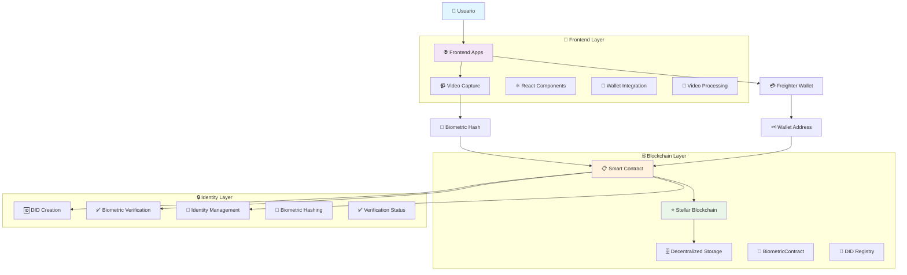

# 🔐 Biometric DID App - Identidad Digital Soberana

Un prototipo de **identidad digital soberana** que utiliza biometría como factor de autenticación, construido sobre la blockchain **Stellar** usando contratos inteligentes **Soroban**.

## 🌟 Características

- **Identidad Descentralizada (DID)**: Cada usuario posee su propia identidad digital verificable
- **Autenticación Biométrica**: Utiliza captura de video facial para generar hashes únicos
- **Blockchain Stellar**: Almacenamiento descentralizado e inmutable de identidades
- **Soroban Smart Contracts**: Lógica de negocio ejecutada en la blockchain
- **Wallet Integration**: Conexión con Freighter para gestión de claves
- **Doble Frontend**: Aplicación Next.js y Vite para máxima flexibilidad

## 🔐 Live Demo On Stellar Testnet 
- [LumID](https://lumid-theta.vercel.app/)

## 🏗️ Arquitectura del Sistema



## 🛠️ Tecnologías Utilizadas

### Backend/Smart Contracts
- **Soroban SDK 22.0.0**: Framework para contratos inteligentes en Stellar
- **Rust**: Lenguaje de programación para contratos seguros
- **Stellar Testnet**: Red blockchain para testing

### Frontend
- **React 19**: Biblioteca de interfaz de usuario
- **Next.js 15**: Framework React con SSR (webapp)
- **Vite 7**: Bundler moderno (frontend alternativo)
- **TypeScript 5**: Tipado estático para JavaScript
- **Tailwind CSS 4**: Framework CSS utility-first

### Blockchain & Web3
- **Stellar SDK 13.3.0**: Interacción con la blockchain Stellar
- **Freighter API 4.1.0**: Integración con wallet Freighter
- **Stellar Wallets Kit 1.7.6**: Gestión de múltiples wallets

### Biometría & Media
- **Face-API.js 0.22.2**: Procesamiento de reconocimiento facial
- **Navigator.mediaDevices**: API nativa para captura de video
- **Web Crypto API**: Hashing criptográfico en el navegador

### Estado & Utilidades
- **Zustand 5.0.6**: Gestión de estado global
- **Crypto-JS 4.2.0**: Utilidades criptográficas adicionales

## 🚀 Instalación

### Prerrequisitos
- Node.js 18+ instalado
- Rust y Cargo instalados
- Freighter wallet extension
- Stellar CLI (opcional para desarrollo)

### 1. Clonar el repositorio
```bash
git clone https://github.com/Hoblayerta/LumId.git
cd biometric-did-app
```

### 2. Instalar dependencias del smart contract
```bash
# Instalar dependencias de Rust
cargo build

# Ejecutar tests del contrato
cd contracts/hello-world
cargo test
```

### 3. Instalar dependencias del frontend

#### Webapp (Next.js)
```bash
cd webapp
npm install
```

#### Frontend alternativo (Vite)
```bash
cd frontend
npm install
```

### 4. Configurar variables de entorno

Crear archivo `.env.local` en cada carpeta de frontend:

```env
NEXT_PUBLIC_STELLAR_NETWORK=testnet
NEXT_PUBLIC_CONTRACT_ID=CBF24N5JQKRQBV2ML4MQL4UU2CARFMOHOQ2PPRMKRRDNSH6PMXKVSE4H
```

## 🎯 Uso

### 1. Iniciar la aplicación

#### Webapp (Next.js)
```bash
cd webapp
npm run dev
```
Abrir http://localhost:3000

#### Frontend alternativo (Vite)
```bash
cd frontend
npm run dev
```
Abrir http://localhost:5173

### 2. Conectar Wallet
1. Instalar Freighter wallet extension
2. Crear/importar una wallet en Testnet
3. Hacer clic en "🚀 Conectar Freighter"

### 3. Crear DID con Biometría
1. Después de conectar la wallet, hacer clic en "🎥 Iniciar Cámara"
2. Permitir acceso a la cámara cuando se solicite
3. Hacer clic en "📸 Capturar Biométricos"
4. Esperar el countdown y mantener la cara visible
5. El sistema procesará la biometría y creará el DID

### 4. Verificar DID
- El DID se almacena en la blockchain Stellar
- Se puede verificar el estado en la interfaz
- El hash biométrico se mantiene privado y seguro

## 📁 Estructura del Proyecto

```
biometric-did-app/
├── 📋 contracts/
│   └── hello-world/
│       ├── src/
│       │   ├── lib.rs          # Smart contract principal
│       │   └── test.rs         # Tests del contrato
│       └── Cargo.toml
├── 🌐 webapp/                  # Aplicación Next.js
│   ├── src/
│   │   ├── app/
│   │   │   ├── page.tsx        # Página principal
│   │   │   └── globals.css     # Estilos globales
│   │   ├── components/
│   │   │   ├── VideoCapture.tsx    # Captura biométrica
│   │   │   ├── WalletConnect.tsx   # Conexión wallet
│   │   │   └── animated-background.tsx
│   │   ├── contracts/
│   │   │   └── contractHelpers.ts  # Helpers del contrato
│   │   ├── hooks/
│   │   │   └── wallet.ts       # Hook de wallet
│   │   ├── store/
│   │   │   └── wallet.ts       # Estado global
│   │   └── types/
│   │       └── freighter.d.ts  # Tipos TypeScript
│   └── package.json
├── 🎨 frontend/                # Aplicación Vite alternativa
│   ├── src/
│   │   ├── components/         # Componentes React
│   │   ├── contracts/          # Helpers de contrato
│   │   ├── hooks/              # Custom hooks
│   │   └── store/              # Estado global
│   └── package.json
├── 📄 Cargo.toml              # Configuración workspace Rust
└── 📖 README.md               # Este archivo
```

## 🔧 Smart Contract - BiometricContract

### Funciones Principales

#### `create_did(wallet_address, biometric_hash)`
- Crea un nuevo DID asociado a una wallet
- Almacena el hash biométrico en la blockchain
- Retorna confirmación de creación

#### `verify_biometrics(wallet_address, new_biometric_hash)`
- Verifica si el hash biométrico coincide
- Marca el DID como verificado si hay coincidencia
- Retorna resultado de verificación

#### `get_did(wallet_address)`
- Obtiene toda la información del DID
- Incluye estado de verificación y timestamps

#### `has_did(wallet_address)`
- Verifica si existe un DID para una wallet específica
- Retorna boolean de existencia

#### `update_biometric_hash(wallet_address, new_hash)`
- Actualiza el hash biométrico (solo si no está verificado)
- Previene cambios después de verificación

### Estructura de Datos

```rust
pub struct BiometricDID {
    pub wallet_address: Address,
    pub biometric_hash: String,
    pub created_at: u64,
    pub is_verified: bool,
}
```

## 🔐 Seguridad

### Consideraciones Implementadas
- **Hashing Biométrico**: Los datos biométricos se procesan localmente y solo se almacena el hash
- **Wallet Authentication**: Verificación de propiedad de wallet antes de operaciones
- **Inmutabilidad**: Una vez verificado, el DID no puede ser modificado
- **Descentralización**: No hay punto único de falla

### Consideraciones para Producción
- Implementar reconocimiento facial más robusto (face-api.js completo)
- Agregar múltiples factores biométricos
- Implementar recuperación de identidad
- Auditoria de seguridad profesional

## 🧪 Testing

### Smart Contract Tests
```bash
cd contracts/hello-world
cargo test
```

### Frontend Tests
```bash
# Webapp
cd webapp
npm test

# Frontend
cd frontend
npm test
```

## 🌐 Deployment

### Smart Contract
1. Compilar contrato: `cargo build --release`
2. Deployar en Stellar Testnet usando Stellar CLI
3. Actualizar CONTRACT_ID en helpers

### Frontend
```bash
# Webapp
cd webapp
npm run build
npm start

# Frontend
cd frontend
npm run build
npm run preview
```

## 🤝 Contribuciones

Las contribuciones son bienvenidas! Por favor:

1. Fork el proyecto
2. Crear una rama para tu feature (`git checkout -b feature/AmazingFeature`)
3. Commit tus cambios (`git commit -m 'Add some AmazingFeature'`)
4. Push a la rama (`git push origin feature/AmazingFeature`)
5. Abrir un Pull Request

## 📝 Licencia

Este proyecto está bajo la licencia MIT. Ver `LICENSE` para más detalles.

## 🙏 Agradecimientos

- **Stellar Development Foundation** por Soroban
- **Freighter Team** por el wallet
- **Face-API.js** por las utilidades de reconocimiento facial
- **React Team** por el framework UI

## 🔗 Enlaces Útiles

- [LumID](https://lumid-theta.vercel.app/)
- [Stellar Documentation](https://stellar.org/developers)
- [Soroban Documentation](https://soroban.stellar.org/)
- [Freighter Wallet](https://freighter.app/)
- [Face-API.js](https://github.com/justadudewhohacks/face-api.js)

---

**⚠️ Aviso**: Este es un prototipo de investigación. No usar en producción sin auditoría de seguridad profesional.
