# 🔐 Biometric DID App - Sovereign Digital Identity

A **sovereign digital identity** prototype that uses biometrics as an authentication factor, built on the **Stellar** blockchain using **Soroban** smart contracts.

## 🌟 Features

- **Decentralized Identity (DID)**: Each user owns their own verifiable digital identity
- **Biometric Authentication**: Uses facial video capture to generate unique hashes
- **Stellar Blockchain**: Decentralized and immutable identity storage
- **Soroban Smart Contracts**: Business logic executed on the blockchain
- **Wallet Integration**: Connection with Freighter for key management
- **Dual Frontend**: Next.js and Vite applications for maximum flexibility

## 🔐 Live Demo On Stellar Testnet 
- [LumID](https://lumid-theta.vercel.app/)

## 🏗️ Arquitectura del Sistema

```mermaid
graph TB
    A[👤 Usuario] --> B[🌐 Frontend Apps]
    B --> C[💳 Freighter Wallet]
    B --> D[📹 Video Capture]
    D --> E[🔐 Biometric Hash]
    E --> F[📋 Smart Contract]
    F --> G[⭐ Stellar Blockchain]
    
    C --> H[🗝️ Wallet Address]
    H --> F
    
    F --> I[🆔 DID Creation]
    F --> J[✅ Biometric Verification]
    F --> K[👤 Identity Management]
    
    G --> L[🗄️ Decentralized Storage]
    
    subgraph "🎨 Frontend Layer"
        B
        D
        M[⚛️ React Components]
        N[🔗 Wallet Integration]
        O[🎥 Video Processing]
    end
    
    subgraph "⛓️ Blockchain Layer"
        F
        G
        L
        P[📝 BiometricContract]
        Q[🏪 DID Registry]
    end
    
    subgraph "🔒 Identity Layer"
        I
        J
        K
        R[🔐 Biometric Hashing]
        S[✅ Verification Status]
    end
    
    style A fill:#e1f5fe
    style B fill:#f3e5f5
    style F fill:#fff3e0
    style G fill:#e8f5e8
```



## 🛠️ Technologies Used

### Backend/Smart Contracts

* **Soroban SDK 22.0.0**: Framework for smart contracts on Stellar
* **Rust**: Programming language for secure contracts
* **Stellar Testnet**: Blockchain network for testing

### Frontend

* **React 19**: UI library
* **Next.js 15**: React framework with SSR (webapp)
* **Vite 7**: Modern bundler (alternative frontend)
* **TypeScript 5**: Static typing for JavaScript
* **Tailwind CSS 4**: Utility-first CSS framework

### Blockchain & Web3

* **Stellar SDK 13.3.0**: Interaction with the Stellar blockchain
* **Freighter API 4.1.0**: Integration with Freighter wallet
* **Stellar Wallets Kit 1.7.6**: Multi-wallet management

### Biometrics & Media

* **Face-API.js 0.22.2**: Facial recognition processing
* **Navigator.mediaDevices**: Native API for video capture
* **Web Crypto API**: Cryptographic hashing in the browser

### State & Utilities

* **Zustand 5.0.6**: Global state management
* **Crypto-JS 4.2.0**: Additional crypto utilities

## 🚀 Installation

### Prerequisites

* Node.js 18+ installed
* Rust and Cargo installed
* Freighter wallet extension
* Stellar CLI (optional for development)

### 1. Clone the repository

```bash
git clone https://github.com/Hoblayerta/LumId.git
cd biometric-did-app
```

### 2. Install smart contract dependencies

```bash
# Install Rust dependencies
cargo build

# Run contract tests
cd contracts/hello-world
cargo test
```

### 3. Install frontend dependencies

#### Webapp (Next.js)

```bash
cd webapp
npm install
```

#### Alternative frontend (Vite)

```bash
cd frontend
npm install
```

### 4. Configure environment variables

Create a `.env.local` file in each frontend folder:

```env
NEXT_PUBLIC_STELLAR_NETWORK=testnet
NEXT_PUBLIC_CONTRACT_ID=CBF24N5JQKRQBV2ML4MQL4UU2CARFMOHOQ2PPRMKRRDNSH6PMXKVSE4H
```

## 🎯 Usage

### 1. Start the application

#### Webapp (Next.js)

```bash
cd webapp
npm run dev
```

Open [http://localhost:3000](http://localhost:3000)

#### Alternative frontend (Vite)

```bash
cd frontend
npm run dev
```

Open [http://localhost:5173](http://localhost:5173)

### 2. Connect Wallet

1. Install Freighter wallet extension
2. Create/import a wallet on Testnet
3. Click on "🚀 Connect Freighter"

### 3. Create DID with Biometrics

1. After connecting the wallet, click on "🎥 Start Camera"
2. Allow camera access when prompted
3. Click "📸 Capture Biometrics"
4. Wait for the countdown and keep your face visible
5. The system will process the biometrics and create the DID

### 4. Verify DID

* The DID is stored on the Stellar blockchain
* You can check the status in the interface
* The biometric hash remains private and secure

## 📁 Project Structure

```
biometric-did-app/
├── 📋 contracts/
│   └── hello-world/
│       ├── src/
│       │   ├── lib.rs          # Main smart contract
│       │   └── test.rs         # Contract tests
│       └── Cargo.toml
├── 🌐 webapp/                  # Next.js application
│   ├── src/
│   │   ├── app/
│   │   │   ├── page.tsx        # Main page
│   │   │   └── globals.css     # Global styles
│   │   ├── components/
│   │   │   ├── VideoCapture.tsx    # Biometric capture
│   │   │   ├── WalletConnect.tsx   # Wallet connection
│   │   │   └── animated-background.tsx
│   │   ├── contracts/
│   │   │   └── contractHelpers.ts  # Contract helpers
│   │   ├── hooks/
│   │   │   └── wallet.ts       # Wallet hook
│   │   ├── store/
│   │   │   └── wallet.ts       # Global state
│   │   └── types/
│   │       └── freighter.d.ts  # TypeScript types
│   └── package.json
├── 🎨 frontend/                # Alternative Vite app
│   ├── src/
│   │   ├── components/         # React components
│   │   ├── contracts/          # Contract helpers
│   │   ├── hooks/              # Custom hooks
│   │   └── store/              # Global state
│   └── package.json
├── 📄 Cargo.toml              # Rust workspace config
└── 📖 README.md               # This file
```

## 🔧 Smart Contract - BiometricContract

### Main Functions

#### `create_did(wallet_address, biometric_hash)`

* Creates a new DID linked to a wallet
* Stores the biometric hash on the blockchain
* Returns confirmation of creation

#### `verify_biometrics(wallet_address, new_biometric_hash)`

* Verifies if the biometric hash matches
* Marks the DID as verified if matched
* Returns verification result

#### `get_did(wallet_address)`

* Retrieves full information about the DID
* Includes verification status and timestamps

#### `has_did(wallet_address)`

* Checks if a DID exists for a specific wallet
* Returns a boolean indicating existence

#### `update_biometric_hash(wallet_address, new_hash)`

* Updates the biometric hash (only if not yet verified)
* Prevents changes after verification

### Data Structure

```rust
pub struct BiometricDID {
    pub wallet_address: Address,
    pub biometric_hash: String,
    pub created_at: u64,
    pub is_verified: bool,
}
```

## 🔐 Security

### Implemented Considerations

* **Biometric Hashing**: Biometric data is processed locally and only the hash is stored
* **Wallet Authentication**: Ownership verification before operations
* **Immutability**: Once verified, the DID cannot be modified
* **Decentralization**: No single point of failure

### Considerations for Production

* Implement more robust facial recognition (full face-api.js)
* Add multiple biometric factors
* Add identity recovery mechanisms
* Perform professional security audit

## 🧪 Testing

### Smart Contract Tests

```bash
cd contracts/hello-world
cargo test
```

### Frontend Tests

```bash
# Webapp
cd webapp
npm test

# Frontend
cd frontend
npm test
```

## 🌐 Deployment

### Smart Contract

1. Compile the contract: `cargo build --release`
2. Deploy to Stellar Testnet using Stellar CLI
3. Update CONTRACT\_ID in helpers

### Frontend

```bash
# Webapp
cd webapp
npm run build
npm start

# Frontend
cd frontend
npm run build
npm run preview
```

## 🤝 Contributions

Contributions are welcome! Please:

1. Fork the project
2. Create a new branch (`git checkout -b feature/AmazingFeature`)
3. Commit your changes (`git commit -m 'Add some AmazingFeature'`)
4. Push the branch (`git push origin feature/AmazingFeature`)
5. Open a Pull Request

## 📝 License

This project is licensed under the MIT License. See `LICENSE` for more details.

## 🙏 Acknowledgments

* **Stellar Development Foundation** for Soroban
* **Freighter Team** for the wallet
* **Face-API.js** for facial recognition utilities
* **React Team** for the UI framework

## 🔗 Useful Links

* [LumID](https://lumid-theta.vercel.app/)
* [Stellar Documentation](https://stellar.org/developers)
* [Soroban Documentation](https://soroban.stellar.org/)
* [Freighter Wallet](https://freighter.app/)
* [Face-API.js](https://github.com/justadudewhohacks/face-api.js)

---

**⚠️ Disclaimer**: This is a research prototype. Do not use in production without a professional security audit.

